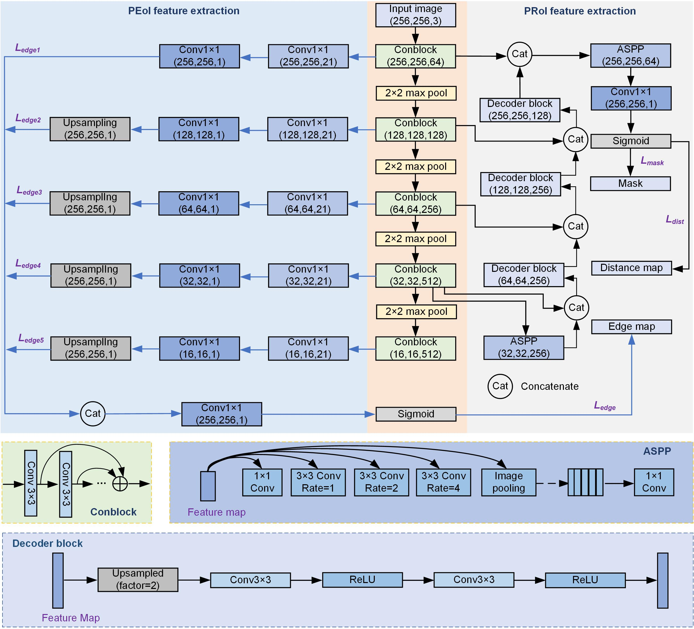

# SEANet

Official Pytorch Code base for "Using a semantic edge-aware multi-task neural network to delineate agricultural parcels from remote sensing images"

[Project](https://github.com/long123524/SEANet_torch.git)

## Introduction

This paper aims to develop a semantic segmentation network for agricultural parcel delineation from remote sensing images, with particular attention to extracting parcels with regularized and closed boundaries. We build a semantic edge-aware multi-task neural network, called SEANet, to enhance the extraction of local and global features regarding the edge and of thematic information regarding agricultural parcels. Compared with conventional CNNs, SEANet fully uses semantic edge features at both the local and global levels, improving the geometric accuracy of agricultural parcel delineation.

<p align="center">
  
</p>


## Using the code:

The code is stable while using Python 3.7.0, CUDA >=11.0

- Clone this repository:
```bash
git clone https://github.com/long123524/SEANet_torch.git
cd SEANet_torch
```

To install all the dependencies using conda or pip:

```
PyTorch
TensorboardX
OpenCV
numpy
tqdm
```

## Preprocessing
You can use the https://github.com/long123524/BsiNet-torch/blob/main/preprocess.py to obtain contour and distance maps.

## Data Format

Make sure to put the files as the following structure:

```
inputs
└── <train>
    ├── image
    |   ├── 001.tif
    │   ├── 002.tif
    │   ├── 003.tif
    │   ├── ...
    |
    └── mask
    |   ├── 001.tif
    |   ├── 002.tif
    |   ├── 003.tif
    |   ├── ...
    └── contour
    |   ├── 001.tif
    |   ├── 002.tif
    |   ├── 003.tif
    |   ├── ...
    └── dist_contour
    |   ├── 001.tif
    |   ├── 002.tif
    |   ├── 003.tif
    └── ├── ...
```

For test datasets, the same structure as the above.

## Pretrained weight

VGG16: link1：https://pan.baidu.com/s/1rdIWgc6DJbxMkuD3OkIoQA  code：01kq 
link2：https://drive.google.com/file/d/1idlA55pLM4EPxWQUvuL0kRj1SHfF32ct/view?usp=drive_link

### Dataset
A GF2 image (1m) is provided for scientific study: https://drive.google.com/file/d/1JZtRSxX5PaT3JCzvCLq2Jrt0CBXqZj7c/view?usp=drive_link 
A corresponding partial field label is provided: https://drive.google.com/file/d/19OrVPkb0MkoaUvaax_9uvnJgSr_dcSSW/view?usp=sharing

## Training and testing

1. Train the model.
```
python train.py
```
2. Evaluate.
```
python accuracy_evaluation.py
```
### Citation:
If you find this work useful or interesting, please consider citing the following references.
```
Citation 1：
{Authors: Long Jiang （龙江）, Li Mengmeng* （李蒙蒙）, Wang Xiaoqin （汪小钦）, et al;
Institute: The Academy of Digital China (Fujian), Fuzhou University,
Article Title: Delineation of agricultural fields using multi-task BsiNet from high-resolution satellite images,
Publication: International Journal of Applied Earth Observation and Geoinformation,
Year: 2022,
Volume:112
Page: 102871,
DOI: 10.1016/j.jag.2022.102871
}
Citation 2：
{Authors: Li Mengmeng* （李蒙蒙）, Long Jiang （龙江）, et al;
Institute: The Academy of Digital China (Fujian), Fuzhou University,
Article Title: Using a semantic edge-aware multi-task neural network to delineate agricultural parcels from remote sensing images,
Publication: ISPRS Journal of Photogrammetry and Remote Sensing,
Year: 2023,
Volume:200
Page: 24-40,
DOI: 10.1016/j.isprsjprs.2023.04.019
}
```
